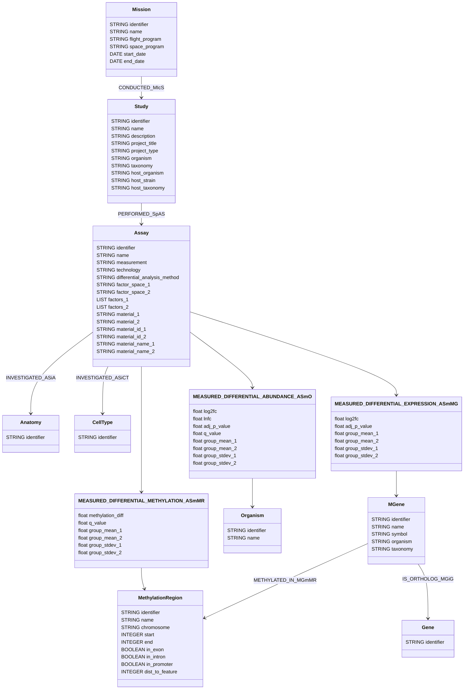

# NASA SPOKE-GeneLab Knowledge Graph

This repository contains the code and metadata needed to build a **Knowledge Graph (KG)** for [NASA GeneLab](https://www.nasa.gov/osdr-genelab-about/) omics datasets hosted on the [Open Science Data Repository (OSDR)](https://osdr.nasa.gov/bio/repo/search?q=&data_source=cgene,alsda&data_type=study).

---

## 🚀 Features

- **Automated graph construction** from datasets in the OSDR
- **Incremental update** for new datasets
- **Statistical filtering** of results for significance
- **Species selection** via a configurable whitelist
- **Versioned metadata** for reproducibility
- **Natural language queries** using [MCP-GeneLab](https://github.com/sbl-sdsc/mcp-genelab)

---

## 🧪 Supported Data Types

| Measurement                  | Technology                                              | Property         | Selection Criteria |
| ---------------------------- | ------------------------------------------------------- | -----------------|-----------------|
| Transcription profiling      | RNA Sequencing (RNA‑Seq)                                | Log2 fold change (expression) | Adjusted p-value <= 0.1 |
| Transcription profiling      | DNA microarray                                          | Log2 fold change (expression) | Adjusted p-value <= 0.1 |
| DNA methylation profiling    | Whole Genome Bisulfite Sequencing                       | Methylation difference % | q-value <= 0.1 |
| DNA methylation profiling    | Reduced‑Representation Bisulfite Sequencing (RRBS)      | Methylation difference % | q-value <= 0.1 |
| Amplicon Sequencing          | 16S, 18S, ITS, 16S and ITS                              | Log2 fold change (abundance) | Adjusted p-value <= 0.1 |
| Amplicon Sequencing          | 16S, 18S, ITS, 16S and ITS                              | Ln fold change (abundance) | q-value <= 0.1 |

---

## ⚙️ How It Works

1. **Fetch** omics study records using the OSDR API  
2. **Filter** datasets by statistical thresholds and target species  
3. **Map** model organism genes to human genes
4. **Map** cell and tissue types to the [Cell (CL)](https://bioportal.bioontology.org/ontologies/CL) and [Uber Anatomy Ontology (UBERON)](https://bioportal.bioontology.org/ontologies/UBERON) ontology, respectively 
5. **Export** CSV files for graph database upload
6. **Import** CSV files into a Neo4j Graph database

---

## 📁 Metadata Directory Structure

The following node and relationship metadata files define the graph schema.

- **Nodes**  
  [https://github.com/BaranziniLab/spoke_genelab/blob/main/kg/v0.3.0/metadata/nodes/](kg/v0.3.0/metadata/nodes/)

- **Relationships**   
  [https://github.com/BaranziniLab/spoke_genelab/blob/main/kg/v0.3.0/metadata/relationships/](kg/v0.3.0/metadata/relationships/)

The organization and conventions for defining the metadata and data are described in the [kg-import](https://github.com/sbl-sdsc/kg-import) Git repository.


## 🕸️ Graph Schema



---

## 🔧 Neo4j Desktop Installation and Configuration

[Installation](https://github.com/BaranziniLab/spoke_genelab/blob/main/docs/neo4j_installation.md)

----

## 📥 Import spoke-genelab Knowledge Graph

[Import](https://github.com/BaranziniLab/spoke_genelab/blob/main/docs/import_db.md)

-----

## 🗣️ Set up Natural Language Queries using MCP-GeneLab

In Claude Desktop, add the following to the claude_desktop_config.json file to connect to a local Neo4j instance.

```json
"spoke-genelab-local": {
  "command": "uvx",
  "args": ["mcp-genelab"],
  "env": {
    "NEO4J_URI": "bolt://localhost:7687",
    "NEO4J_USERNAME": "neo4j",
    "NEO4J_PASSWORD": "neo4jdemo",
    "NEO4J_DATABASE": "spoke-genelab-v0.3.0",
    "INSTRUCTIONS": "Query the GeneLab KG to identify NASA spaceflight experiments containing omics datasets, specifically differential gene expression (transcriptomics), DNA methylation (epigenomics) and Amplicon (metagenomics) data."
  }
},
```

[For details see mcp-genelab](https://github.com/sbl-sdsc/mcp-genelab)

------

## ⚙️ Create spoke-genelab Knowledge Graph (for developers)

[Create KG](https://github.com/BaranziniLab/spoke_genelab/blob/main/docs/create_kg.png)

------

## 🔗 SPOKE - GeneLab Composite Database


**Figure**: Integration of the SPOKE and GeneLab knowledge graphs using proxy nodes.  
The **GeneLab** graph (right), a knowledge graph representing spaceflight omics datasets, depicts key experimental entities: `Assay`, `Study`, `Mission`, `MGene`, and `MethylationRegion`, along with their relationships. 
**Proxy nodes** (gray) represent external identifiers (ENTREZ, UBERON, CL) and enable linkage to the **[SPOKE](https://spoke.ucsf.edu/)** graph (left), a rich biomedical knowledge graph comprising biological processes, molecular functions, diseases, compounds, and more. The dashed lines indicate mappings to enable the construction of a [composite Neo4j graph database](https://neo4j.com/docs/operations-manual/current/tutorial/tutorial-composite-database/). The composite graph enables federated queries across multiple KGs.

--------

## 📚 Citation

PW Rose, CA Nelson, SG Gebre, AM Saravia-Butler, K Soman, KA Grigorev, LM Sanders, SV Costes, SE Baranzini, NASA SPOKE-GeneLab Knowledge Graph. Available online: https://github.com/BaranziniLab/spoke_genelab (2025)

CA Nelson, PW Rose, K Soman, LM Sanders, SG Gebre, SV Costes, SE Baranzini, Nasa Genelab-Knowledge Graph Fabric Enables Deep Biomedical Analysis of Multi-Omics Datasets, https://ntrs.nasa.gov/citations/20250000723 (2025)

------

## 💰 Funding
NSF Award number [2333819](https://www.nsf.gov/awardsearch/showAward?AWD_ID=2333819), Proto-OKN Theme 1: Connecting Biomedical information on Earth and in Space via the SPOKE knowledge graph.

