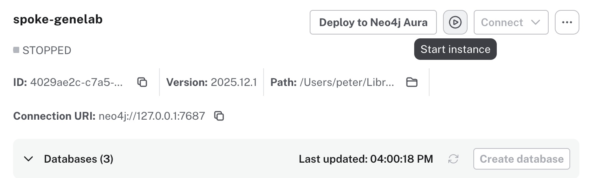
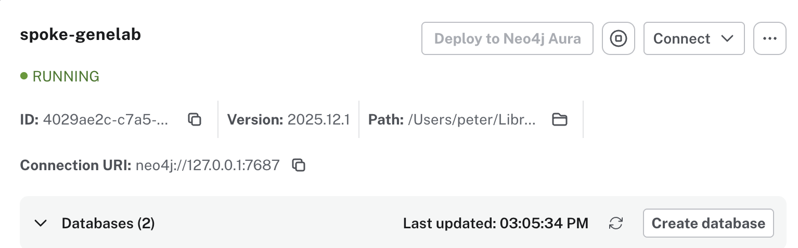
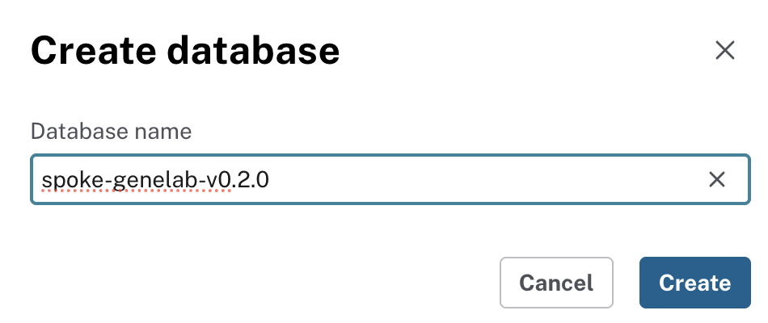
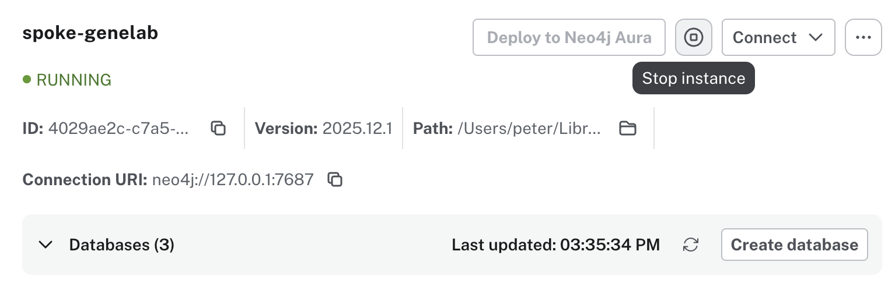
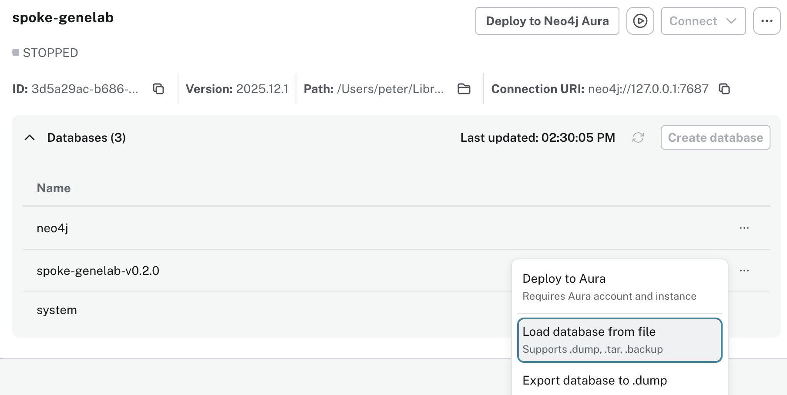
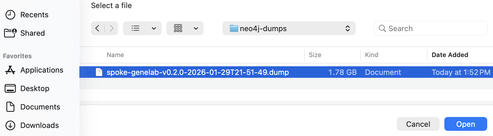
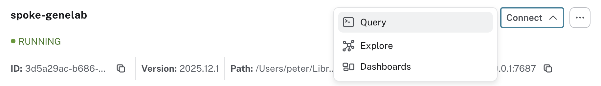
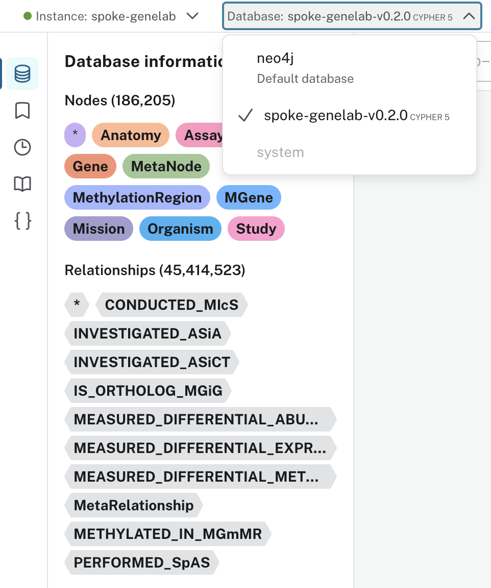
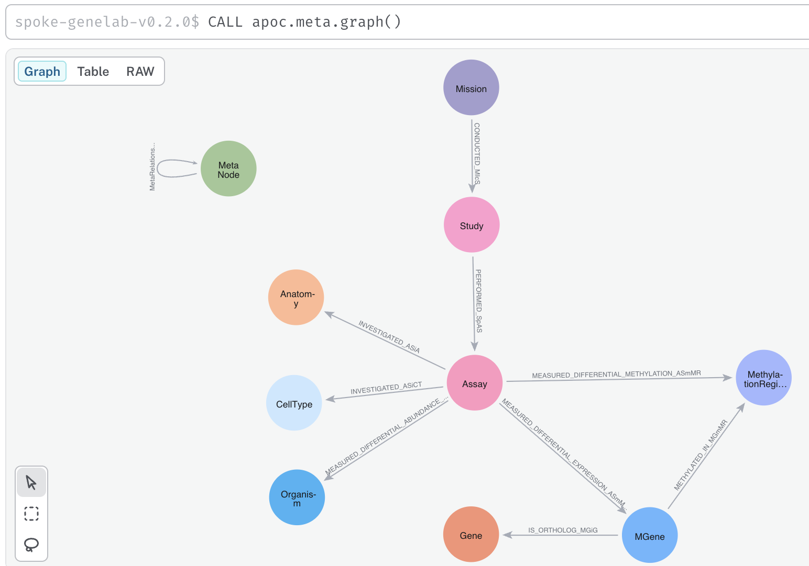

## 📥 Import spoke-genelab Knowledge Graph

> Note: The spoke-genelab instance can hold multiple versions of the spoke-genelab KG.

1. Download the Neo4j dump file

2. Launch Neo4j Desktop and start the `spoke-genelab` instance

  

2. Click `Create database` 

  

3. Enter the exact database name, e.g., spoke-genelab-v0.2.0
4. 

  

4. Stop the instance

> A database can only be imported into a stopped instance.

  

4. Select `Load database from file` for them `...` menu next to the new database

  

 

5. Import dump file

> Choose the option: `Allow overwriting` when importing the file.

 

  

  

## Optional: Explore the KG

6. Start the instance

  

7. Select `Query` from the `Connect` menu

  

8. Select the database version that was imported (wait until the data are loaded ~ 30 seconds)

> Details about the nodes and relationships are displayed

  

9. Display the KG schema. Type `CALL apoc.meta.graph()` in the query dialog box

> Drag the nodes to rearange them

  

