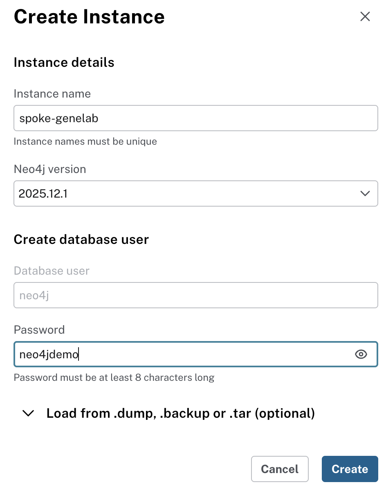
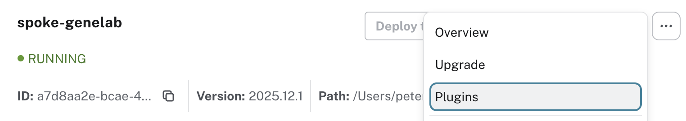
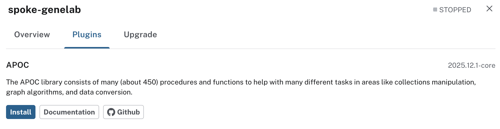

## 🔧 Neo4j Desktop Installation and Configuration

### Install Neo4j Desktop

1. Download the Neo4j Desktop 2.x application from the [Neo4j Download Center](https://neo4j.com/deployment-center/?desktop-gdb) and follow the installation instructions.

### Create the spoke-genelab Instance

> Note, create a spoke-genelab instance once, then multiple spoke-genelab KGs can be imported into this instance

2. Launch Neo4j Desktop

3. Click ```Create Instance``` and enter the following information

<p align="center">
  
</p>

### Install APOC Plugin
4. Select `Plugins` from the menu 

<p align="center">
  
</p>

5. Install the `APOC` plugin and click `Restart` when prompted to complete the installation

<p align="center">
  
</p>


